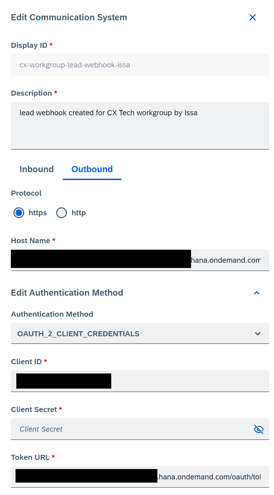

# Lead Webhook

We will create a webhook for Leads from the Sales Cloud and Service Cloud v2.
We build upon the steps described in the SAP Cloud SDK javascript "Getting Started" Tutorial to create a complete flow.  
We will create a webhook that will make a copy of a lead when it's status changes to 'Lost'.  
https://sap.github.io/cloud-sdk/docs/js/tutorials/getting-started/set-up-dev-environment  

__The result after every step can be found in a branch named after that completed step.__


## Prerequisites

- Credentials for SAP SSCV2
- SAP BTP (Trial) Account


## Initial Setup
In your IDE of choice open the folder where you would like to create the project. In this folder, open the terminal and go through the following steps.

### Node & npm
We will need Node.js and npm.  
Check if these are already installed:
```bash
  node -v
  npm -v
```

If not installed:  
https://nodejs.org/en/download

### Nest CLI  

```bash
  npm i -g @nestjs/cli
```

### Cloud Foundry CLI  
Check if installed:
```bash
  cf -v
```
If not installed:  
https://github.com/cloudfoundry/cli/wiki/V8-CLI-Installation-Guide#installers-and-compressed-binaries  

### Create a new project  
Using the Nest CLI, create the project.
```bash
  nest new lead-webhook
```  
Add the `manifest.yml` file to the root of the project: 
```bash
    applications:
      - name: lead-webhook
        path: .
        buildpacks:
          - nodejs_buildpack
        memory: 256M
        command: npm run start:prod
        random-route: true
```

## 1. Add the endpoint  
The base route currently returns 'Hello World', we will add the route where we'll handle a GET on '/lead' and a POST on '/lead'.  

Create a new controller:
```bash
  nest g controller lead
```
This creates a new folder and controller under `src/lead`.  
We will add a GET and POST route to this controller:  
```typescript
  import { Controller, Get, Post} from '@nestjs/common';

  @Controller('lead')
  export class LeadController {

      @Get()
      getLeads(){
        
      }

      @Post()
      createCopyOfLead(){
        
      }
  }
```  


## 2. Generate Service Entities  
Install the `@sap-cloud-sdk/openapi-generator` package.  
```bash
  npm install @sap-cloud-sdk/openapi-generator
```

Create a folder `/service-specs` at the root of the project.
Download the JSON API Specification for the Lead service:  
https://api.sap.com/api/SalesSvcCloudV2_lead/overview  
And place it in the newly created folder.  

Next generate the service entities with the following command:  
```bash
  npx openapi-generator --input ./service-specs --outputDir services
```
## 3. Setup BTP Destination  
In your SAP BTP Subaccount go to `Connectivity>Destinations` and press `Create Destination`.  
Enter the following details:  
- Name: SSCV2 **This exact name will be used in the application .env file**
- Type: HTTP
- URL: *url to SSCV2 system example: https://xxx.xx.crm.cloud.sap*
- Authentication: Basic Authentication
- User: *SSCV2 Technical User email or your own user for testing purposes*
- Password: *SSCV2 Technical User password or your own user for testing purposes*  

Back in the command line inside your project execute the following:  
```bash
  cf api https://api.cf.<region>.hana.ondemand.com
  cf login
```  
You can find your api url on the `Overview` page of your BTP subaccount under `Cloud Foundry Environment>API Endpoint`.  
Login using the credentials for your subaccount.  

In your project create a `.env` file under the root of the project containing:  
```bash
  DESTINATION_NAME:SSCV2
  LEAD_COPY_TEXT_ADDITION=Webhook v1
```  
Import the `@nestjs/config` package:  
```bash
  npm install @nestjs/config
```
In the `src/app.module.ts` add the following import statement:  
```typescript
  import { ConfigModule } from '@nestjs/config';
```  
And the following in the `@Module>imports` in the same file:  
```typescript
  imports: [ConfigModule.forRoot()],
```  
Create destination service instance:  
```bash
  cf create-service destination lite lead-webhook-destination
```  
Create a `xs-security.json` file in the root of your project.  
```json
{
    "xsappname": "lead-webhook",
    "tenant-mode": "dedicated"
}
```  
Create the `xsuaa` service instance.  
```bash
cf create-service xsuaa application lead-webhook-xsuaa -c xs-security.json
```  
Add the service to the `manifest.yml`:  
```bash
    applications:
      - name: lead-webhook
        path: .
        buildpacks:
          - nodejs_buildpack
        memory: 256M
        command: npm run start:prod
        random-route: true
        services:
          - lead-webhook-destination
          - lead-webhook-xsuaa
```
## 4. Handle GET endpoint  
The GET on '/lead' will return all leads in the connected SSCV2 system.  
### Service
First we generate the service:
```bash
  nest g service lead
```

A basic service has been generated under `/src/lead`:  
```typescript
  import { Injectable } from '@nestjs/common';

  @Injectable()
  export class LeadService {}
```  

To import the service function and types, add the following lines to the top of the service class.  
```typescript
  import {
      LeadApi,
      Leadqueryresponse,
      Leadfile
  } from '../../services/SalesSvcCloudV2_lead';
```  
Create a function `getLeads()` and execute the request.  
```typescript
  async getLeads(): Promise<Leadqueryresponse> {
      return await LeadApi.queryleadserviceLead().execute({
          destinationName: process.env.DESTINATION_NAME
      }).catch(error => {
          throw new HttpException(`Failed to get leads - ${error.message}`, 500);
      });
  }
```  
### Controller

Add the service call to the controller. 
We add the import statements for the service and the response type. A constructor is added to inject the service.
```typescript
  import { Controller, Get, Post} from '@nestjs/common';
  import { LeadService } from './lead.service';
  import { Leadqueryresponse } from 'services/SalesSvcCloudV2_lead';

  @Controller('lead')
  export class LeadController {
      constructor(private readonly leadService: LeadService) {}

      @Get()
      getLeads(): Promise<Leadqueryresponse> {
        return this.leadService.getLeads();
      }

      @Post()
      createCopyOfLead(){
        
      }
  };
```  
You can test this by deploying the application and calling the /lead (GET) endpoint.  
To deploy follow the steps in the section `Deploy to Cloud Foundry`.

## 5. Handle POST endpoint  
### Service
First we will complete the `createCopyOfLead` function in the `LeadService`.  
```typescript
  async createCopyOfLead(id): Promise<Leadfile> {
        // Read complete Lead from LeadApi
        const readLeadResponse = await LeadApi
            .readleadserviceLead(id)
            .execute({ destinationName: process.env.DESTINATION_NAME })
            .catch(error => {
                throw new HttpException(`Failed to retrieve complete lead - ${error.message}`, 500);
            });
        const originalLead = readLeadResponse.value;
        console.log("Complete Lead to copy:");
        console.log(originalLead);

        // Determine fields for Lead Copy
        const copyLeadName = originalLead.name + ' ' + process.env.LEAD_COPY_TEXT_ADDITION;

        // Create Lead Copy using LeadApi
        const createdCopyLead = await LeadApi.createleadserviceLead({
            name: copyLeadName,
            startFrom: originalLead.dueUntil,
            account: originalLead.account,
            businessArea: originalLead.businessArea,
            contacts: originalLead.contacts
        }).execute({ destinationName: process.env.DESTINATION_NAME })
        .catch(error => {
            throw new HttpException(`Failed to create copy of lead - ${error.message}`, 500);
        });
        console.log("Created Copy Lead:");
        console.log(createdCopyLead);
        return createdCopyLead;
    }
```  
The function will receive the `id` of the incoming lead. We do this because when the webhook is triggered, the lead object is sent in the body but it does not contain all the properties.  
With this `id` we will call the `LeadApi` ourselves to get the complete object.  
Afterwards we will append our chosen text to the name so the copy has an altered name.  
Finally we will create the copy of the incoming Lead.  
### Controller  
The `@Post()` in the controller will now look like this:  
```typescript
  @Post()
    async createCopyOfLead(@Body() body){
        try {
            console.log("Incoming Lead id:");
            console.log(body.data?.currentImage?.id);
            await this.leadService.createCopyOfLead(body.data?.currentImage?.id);
            return { status: 'success' };
        } catch (error) {
            console.error(error);
            throw new HttpException(error.message, HttpStatus.INTERNAL_SERVER_ERROR);
        }
    }
```  
You can test this by deploying the application and calling the /lead (GET) endpoint.  
To deploy follow the steps in the section `Deploy to Cloud Foundry`.
## 6. Add Authentication  
We will make sure that all incoming request must be authenticated through the `xsuaa` instance in your subaccount.  
We will be using `@sap/xsenv`, `@sap/xssec` and `passport`.  
```bash
  npm i @sap/xsenv
  npm i @sap/xssec
  npm i passport
```  
In the `package.json` look for the `@sap/xssec` and replace the version with `"3.6.1"` and run `npm install`.  
To reject all Unauthenticated incoming request we need to add the following to our `main.ts`.  
```typescript
import { NestFactory } from '@nestjs/core';
import { AppModule } from './app.module';
import { getServices } from '@sap/xsenv';
import * as passport from 'passport';
import { JWTStrategy } from '@sap/xssec';

async function bootstrap() {
  const app = await NestFactory.create(AppModule);

  // Retrieve the UAA service details
  const uaaService = getServices({ uaa: { tag: 'xsuaa' } }).uaa;

  // Register the JWTStrategy with passport
  passport.use(new JWTStrategy(uaaService));

  // Initialize passport middleware
  app.use(passport.initialize());

  // Apply JWT authentication middleware to all routes
  app.use(passport.authenticate('JWT', { session: false }));

  await app.listen(process.env.PORT ?? 3000);
}
bootstrap();
```  
Now all incoming request will be blocked except those authenticated by the `lead-webhook-xsuaa` instance.  
Next we will deploy the application and do the neccesary configuration in the Sales and Service Cloud v2.

## Deploy to Cloud Foundry  
**Ensure the `manifest.yml` is present and up to date.**  
First adapt the script `npm run start:prod` to the following:  
```bash
  "start:prod": "node dist/src/main"
```  
Build the project.  
```bash
  npm run build
```
Deploy.
```bash
  cf push
```
If not logged in:  
```bash
  cf api https://api.cf.<region>.hana.ondemand.com
  cf login
```  
You can view your deployed application in your BTP Subaccount under `Cloud Foundry>Spaces>*yourspace*>lead-webhook`. Here you can also view the Logs for your application.
## Sales and Service Cloud v2 Configuration  
### Communication System  
The `Communication System` will save the url and credentials for our application.  
It's comparable with the `Destination` in our BTP subaccount.  
Because all requests to the application need to be authenticated, we need to create a service-key for our `xsuaa` instance.  

Go to your BTP Subaccount and open `Services>Instances and Subscriptions>Instances>lead-webhook-xsuaa`.  
In the menu under `Service Keys` press `create`, give it a name and press `create`.  

When the key has been created open it and in another tab open the Sales and Service Cloud v2.  
When Logged in, press your profile icon in the top-right corner and press `Settings`.  
Press the tab `All Settings` and search for `Communication Systems`.  

Inside the Communication Systems press `+`, enter a unique name and a description.  
Press `Outbound`, select `https` and enter the following details:  
- Host Name: *url of lead-webhook*
- Authentication Method: OAUTH_2_Client_Credentials
- Client ID: *client id as shown in service-key*
- Client Secret: *client secret as shown in service-key*
- Token URL: *url as shown in service-key appended by '/oauth/token'*


### Autoflow
The autoflow is what will effectively trigger the entire flow.  
Navigate back to `Settings>All Settings` and search for `Autoflow`.  
 Configure it as shown in the image below, the check on `name contains` can be changed as you wish.  

Now you have a complete flow and are able to test by creating a Lead with a name containing the text you mentioned in the Autoflow.  
When changing the status for that Lead to Declined the webhook should be triggered and another Lead should appear after refreshing.
## Authors

- [@issa-flore](https://www.github.com/issa-flore)

